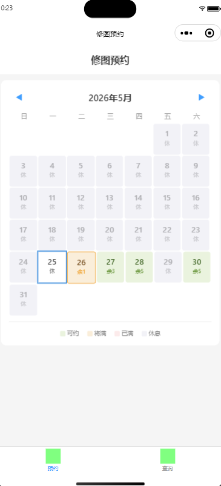
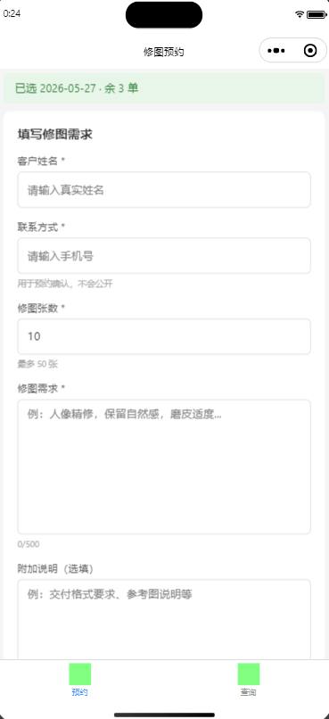
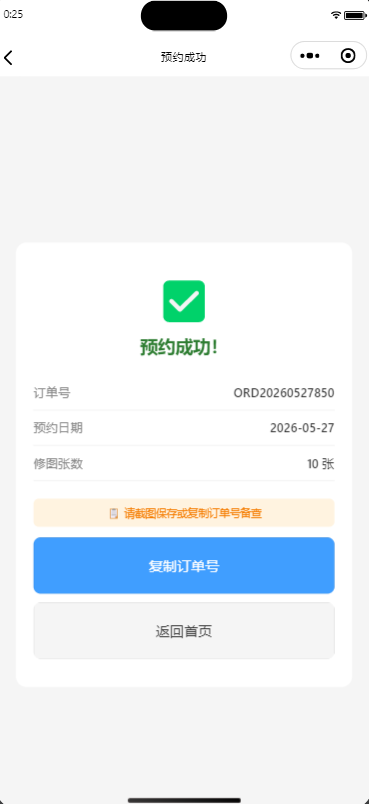
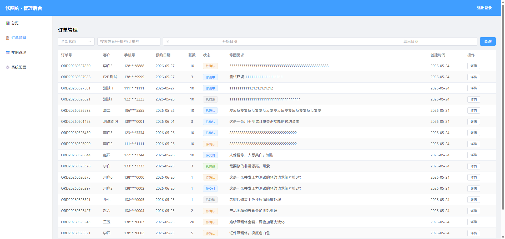
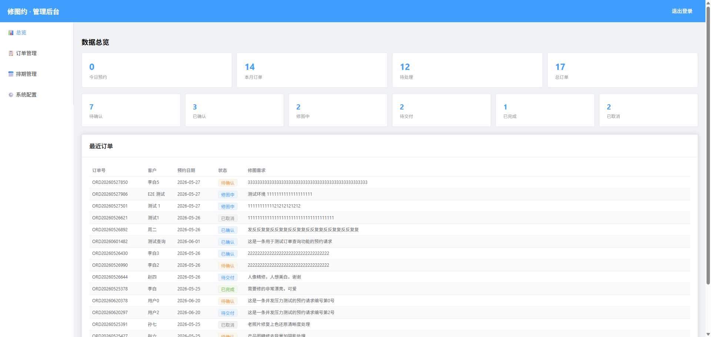
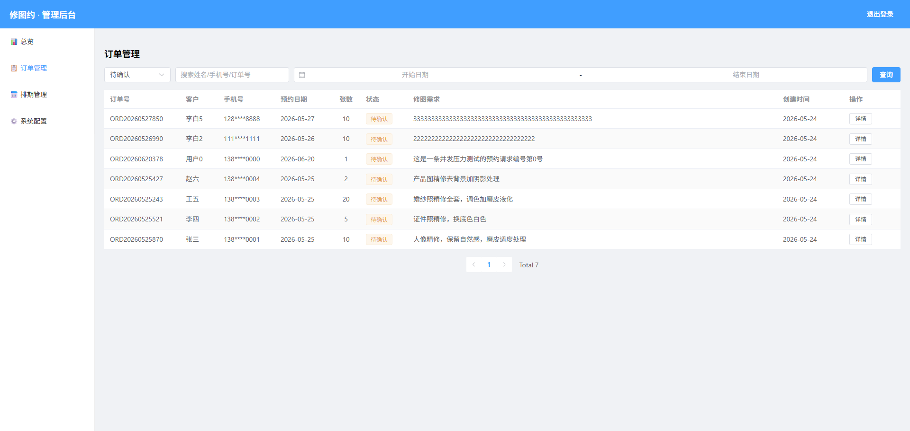
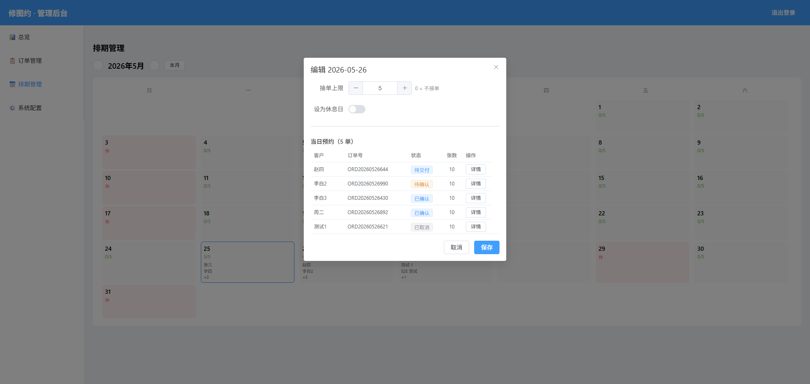
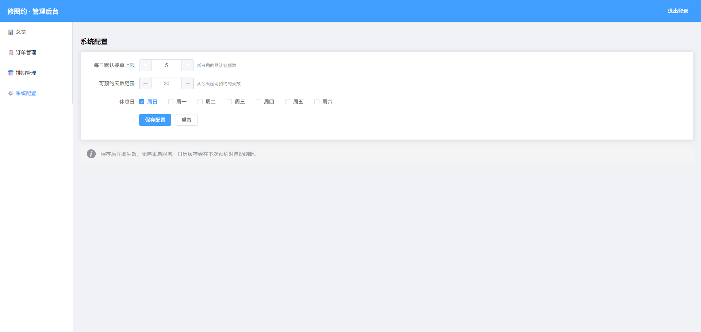

# 修图约 · Pixbook

> 修图服务预约排期系统 — 微信小程序版

面向个人修图师和小型工作室的在线预约排期系统，解决人工排期混乱、超额接单、沟通成本高等痛点。

---

## 截图

> 截屏后放入 `docs/screenshots/`，替换下方占位图路径。建议尺寸：小程序 390×844，管理后台 1440×900。

### 📱 小程序

| 页面 | 截图 |
|------|:--:|
| 首页日历 |  |
| 预约表单 |  |
| 提交成功 |  |
| 订单查询 |  |

### 🖥️ 管理后台

| 页面 | 截图 |
|------|:--:|
| 总览仪表盘 |  |
| 订单管理 |  |
| 排期管理 |  |
| 系统配置 |  |

---

## 功能

### 📱 小程序（用户端）

| 页面 | 功能 |
|------|------|
| 首页日历 | 月视图 · 5 种状态颜色 · 选日期 · 月份切换 |
| 预约表单 | 5 字段校验 · 乐观锁防超卖 · 幂等防重复 |
| 成功页 | 订单号 · 日期 · 张数 · 一键复制 |
| 查询页 | 姓名 + 手机号 或 姓名 + 订单号 |

### 🖥️ 管理后台

| 页面 | 功能 |
|------|------|
| 总览 | 汇总卡片 + 状态卡片（可点击筛选）· 最近订单 |
| 订单管理 | 表格 · 筛选 · 分页 · 详情抽屉 · 6 种状态流转 |
| 排期管理 | 月历 · 点击设置名额/休息日 · 当日预约列表 |
| 系统配置 | 每日上限 · 预约天数 · 周休日 · 保存即时生效 |

### 状态流转

```
待确认(0) → 已确认(1) → 修图中(2) → 待交付(3) → 已完成(4)
    │            │            │
    └─── 已取消(5) ←───────────┘
```

---

## 技术栈

| 层 | 技术 |
|----|------|
| 小程序 | uni-app + Vue 3 + TypeScript + 原生 CSS |
| 管理后台 | Vue 3 + Vite + Element Plus + TypeScript |
| 后端 | NestJS + Prisma ORM + MySQL 8 + Redis 7 |
| 部署 | Docker Compose / Nginx + PM2 |

---

## 项目结构

```
Pixbook/
├── apps/
│   ├── miniprogram/         # uni-app 微信小程序
│   │   └── src/
│   │       ├── pages/       # index / success / query
│   │       ├── composables/ # useCalendar / useBooking / useAuth / useOrderQuery
│   │       └── api/         # request.ts 封装
│   └── admin/               # Vue 3 管理后台
│       └── src/
│           ├── views/       # Dashboard / Orders / Schedule / Config
│           ├── components/  # AdminLayout
│           └── api/         # Axios + JWT 拦截器
├── packages/
│   └── server/              # NestJS 后端
│       └── src/modules/
│           ├── schedule/    # 排期日历 API
│           ├── order/       # 订单提交/查询/管理
│           ├── wechat/      # 微信静默登录
│           ├── config/      # 全局配置 CRUD
│           └── auth/        # JWT 鉴权 Guard
├── docker-compose.yml       # MySQL 8 + Redis 7
├── docs/                    # 部署指南 + 审核清单
└── .ai-system/              # 项目管理文档（决策/经验/错误/里程碑）
```

---

## 快速开始

### 环境要求

- Node.js 24+
- pnpm 9+
- Docker & Docker Compose

### 1. 安装依赖

```bash
pnpm install
```

### 2. 启动数据库

```bash
docker compose up -d
```

### 3. 配置环境变量

```bash
cp packages/server/.env.example packages/server/.env
```

编辑 `.env`，填入你的微信 AppID / AppSecret。

### 4. 初始化数据库

```bash
pnpm --filter @pixbook/server db:migrate
pnpm --filter @pixbook/server db:seed
```

### 5. 启动开发服务

```bash
# 后端 API (http://localhost:3000)
pnpm dev:server

# 管理后台 (http://localhost:5173)
pnpm dev:admin

# 小程序（微信开发者工具打开 dist/dev/mp-weixin）
pnpm dev:mp
```

---

## 测试

### 运行单元测试

```bash
pnpm --filter @pixbook/server test
```

### 运行并发测试

```bash
pnpm --filter @pixbook/server test:concurrent
```

### 运行 E2E 全链路测试

1. 手机扫码打开小程序 → 选日期 → 提交预约 → 记下订单号
2. 管理后台 → 订单管理 → 搜订单号 → 详情 → 流转状态
3. 小程序 → 查询页 → 输入姓名+订单号 → 确认状态已更新

---

## 部署

详见 [`docs/deployment.md`](docs/deployment.md)。

简要步骤：

1. 配置生产环境变量（JWT_SECRET、数据库密码等）
2. `pnpm --filter @pixbook/server build`
3. `pnpm --filter @pixbook/admin build`
4. Nginx 反向代理 + SSL
5. PM2 守护后端进程
6. 微信公众平台配置合法域名

---

## 文档索引

| 文档 | 说明 |
|------|------|
| [部署指南](docs/deployment.md) | 生产环境部署步骤 |
| [审核清单](docs/review-checklist.md) | 小程序提交审核准备 |
| [产品需求文档 (PRD)](dev-rpd-md/修图约-Pixbook_PRD_V1.0.md) | 原始需求 |
| [开发实施文档](dev-rpd-md/修图约-Pixbook_Dev_V1.0_小程序版.md) | 技术设计 |
| [项目状态](.ai-system/project_state.md) | 当前进度 |
| [决策记录](.ai-system/MEMORY/decisions.md) | 17 条架构决策 |
| [经验教训](.ai-system/MEMORY/learnings.md) | 12 条踩坑经验 |
| [错误记录](.ai-system/MEMORY/mistakes.md) | 16 条 Bug 记录 |
| [里程碑](.ai-system/TASKS/milestone.md) | M0-M4 |

---

## 项目状态

🎉 **MVP v1.0.0 已交付**

- 17 单元测试 · 11 API 端点 · 10 并发零超卖
- 4 个 Phase 全部完成
- 管理后台 + 小程序 + 后端 API 全栈可用
