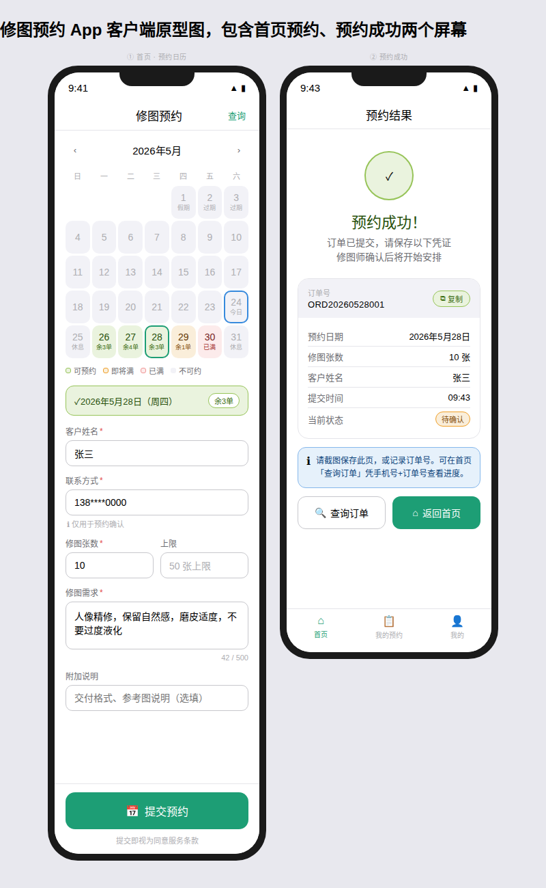
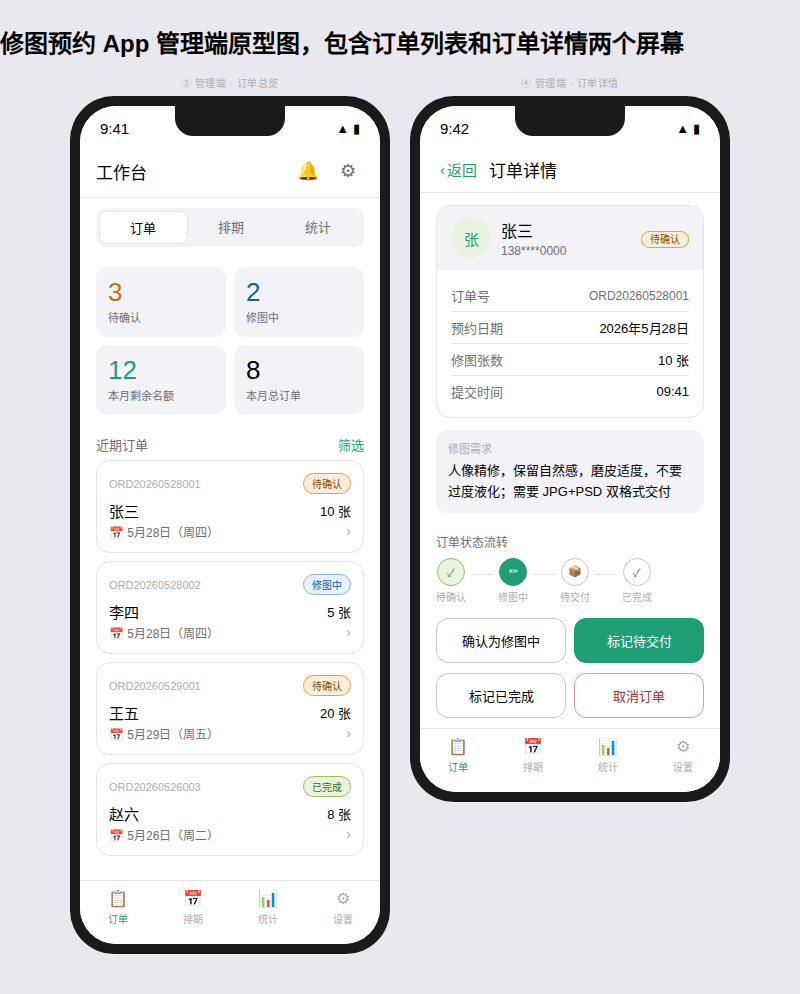

# 修图服务预约排期系统 PRD / 原型设计文档

> **文档版本：** V1.0
> **更新时间：** 2026-05
> **文档类型：** 产品需求 + 原型设计
> **适用对象：** 产品经理 / UI 设计 / 前端 / 后端 / 测试

---

## 目录

1. [项目概述](#一项目概述)
2. [系统角色设计](#二系统角色设计)
3. [核心业务规则](#三核心业务规则)
4. [系统功能架构](#四系统功能架构)
5. [客户端原型设计](#五客户端原型设计)
6. [后台管理原型设计](#六后台管理原型设计)
7. [交互流程设计](#七交互流程设计)
8. [边界情况与异常处理](#八边界情况与异常处理)
9. [API 接口设计](#九api-接口设计)
10. [数据库设计](#十数据库设计)
11. [非功能性需求](#十一非功能性需求)
12. [技术架构建议](#十二技术架构建议)
13. [测试方案](#十三测试方案)
14. [产品优化建议](#十四产品优化建议)
15. [项目里程碑](#十五项目里程碑)

---

## 一、项目概述

### 1.1 项目背景

当前个人修图师通常通过微信、QQ 或社交平台进行人工接单，存在以下问题：

- 客户无法直观看到可预约时间
- 高峰期容易出现超额接单
- 客户与修图师频繁沟通确认档期
- 手动排期效率低，容易遗漏订单
- 并发预约时容易出现"撞单"问题

因此，需要构建一套「修图服务预约排期系统」，实现预约流程标准化、排期透明化与订单管理自动化。

### 1.2 项目目标

构建一个适用于个人修图师、小型工作室的在线预约排期系统：

**用户侧目标**

- 查看未来可预约档期
- 实时查看每日剩余接单名额
- 自主选择预约日期
- 在线提交修图需求
- 获得预约凭证与结果反馈

**管理侧目标**

- 灵活配置每日接单上限
- 统一管理预约订单
- 自动控制排期容量
- 避免超额接单
- 提升客户预约体验

### 1.3 产品定位

本系统属于：

- 修图服务预约管理工具
- 轻量级排期预约系统
- 个人工作室订单管理系统

**适用人群：** 人像修图师、商业修图工作室、摄影后期团队、电商修图团队、自由职业后期人员

---

## 二、系统角色设计

### 2.1 客户端用户

| 操作 | 说明 |
|------|------|
| 查看预约日历 | 查看未来 30 天排期状态 |
| 查看每日剩余名额 | 实时显示每日可预约数量 |
| 选择预约日期 | 点击可用日期进行选择 |
| 提交修图需求 | 填写订单表单并提交 |
| 获取预约凭证 | 预约成功后获得订单号 |
| 查看预约状态 | 凭订单号查询当前进度 |

### 2.2 管理员（修图师）

| 操作 | 说明 |
|------|------|
| 配置每日接单上限 | 设置每天最大接单数量 |
| 设置休息日 | 指定不可预约的日期 |
| 查看预约情况 | 日历视图查看整体排期 |
| 管理订单状态 | 手动更新订单处理进度 |
| 查看客户信息 | 查阅订单详情及客户需求 |
| 调整排期配置 | 临时修改特定日期的名额上限 |

### 2.3 管理员认证

- 管理员通过账号密码登录后台
- 登录后颁发 JWT Token，有效期 7 天
- Token 过期后自动跳转登录页，不丢失当前操作路径
- 当前版本仅支持单管理员账户；后续版本可扩展多管理员

---

## 三、核心业务规则

### 3.1 基础规则配置

| 配置项 | 默认值 | 是否可配置 | 备注 |
|--------|--------|-----------|------|
| 每日最大接单量 | 5 单 | 是 | 管理员后台调整 |
| 可预约范围 | 未来 30 天 | 是 | 不含当天 |
| 默认休息日 | 周日 | 是 | 可添加临时休息日 |
| 单次最大修图张数 | 50 张 | 是 | 超出提示不可提交 |
| 最小预约时间 | 次日起 | — | 当天不可预约（T+1） |

> ⚠️ **重要约定：** 当天（今日）仅展示状态，不可点击预约。可预约范围为明天起至未来 30 天。

### 3.2 日期状态规则

| 状态 | 视觉表现 | 是否可点击 | 判定条件 |
|------|---------|-----------|---------|
| 可预约 | 绿色 | ✅ 是 | 剩余名额 ≥ 2 |
| 即将约满 | 橙色 | ✅ 是 | 剩余名额 = 1 |
| 已满 | 红色 | ❌ 否 | 剩余名额 = 0 |
| 不可预约 | 灰色 | ❌ 否 | 超出范围 / 休息日 / 已过期 |
| 今日 | 蓝色边框 | ❌ 否 | 当前日期（仅标识，不可预约）|

### 3.3 名额计算逻辑

```
剩余名额 = 每日最大接单量 - 已预约订单数（状态不为"已取消"）
```

- 系统实时动态计算，每次访问日历时刷新
- Redis 缓存日历数据，TTL 60 秒，写操作直接失效缓存

### 3.4 并发控制机制

为避免多用户同时预约同一日期导致超卖，采用**乐观锁 + 数据库事务**方案：

**核心处理流程：**

```
1. 用户提交订单，携带当前日期的 version 值
2. 数据库执行：
   UPDATE schedules
   SET booked_slots = booked_slots + 1, version = version + 1
   WHERE date = ? AND version = ? AND booked_slots < max_slots
3. 若影响行数 = 1 → 成功，创建订单记录
4. 若影响行数 = 0 → 失败（名额已变化或已满）
5. 失败时返回错误码，前端提示并刷新日历
```

**冲突重试策略：**

- 服务端最多自动重试 **1 次**
- 2 次均失败则返回前端，提示用户重新选择日期
- 前端收到冲突错误后自动刷新日历，不清空已填写的表单

### 3.5 同一客户重复预约规则

- 同一手机号在同一日期内**只允许提交 1 次**订单
- 重复提交时提示："您已预约该日期，如需修改请联系修图师"
- 不同日期可多次预约

---

## 四、系统功能架构

### 4.1 客户端功能模块

| 功能模块 | 功能说明 | 优先级 |
|---------|---------|-------|
| 预约日历 | 展示未来可预约日期及状态 | P0 |
| 名额显示 | 展示每日剩余数量 | P0 |
| 日期选择 | 点击选择预约日期 | P0 |
| 订单表单 | 填写修图需求及联系方式 | P0 |
| 表单校验 | 实时校验输入合法性 | P0 |
| 预约提交 | 提交订单并防重复提交 | P0 |
| 预约凭证 | 展示订单号及预约信息摘要 | P0 |
| 订单查询 | 凭手机号+订单号查询状态 | P1 |

### 4.2 管理后台功能模块

| 功能模块 | 功能说明 | 优先级 |
|---------|---------|-------|
| 排期管理 | 月历视图查看/调整排期 | P0 |
| 订单管理 | 查看订单详情、更新状态 | P0 |
| 配置管理 | 设置每日上限、休息日规则 | P0 |
| 管理员登录 | 账号密码登录 + JWT 鉴权 | P0 |
| 消息通知 | 新订单站内/浏览器推送提醒 | P1 |
| 数据统计 | 查看预约数量趋势图 | P2 |

---

## 五、客户端原型设计




> **屏幕说明：** ① 首页预约日历（含日期状态、表单填写、提交按钮） · ② 预约成功凭证页

### 5.1 整体页面结构

```
┌─────────────────────────────────────┐
│  🎨 修图预约                    Logo │
├─────────────────────────────────────┤
│                                     │
│   ① 日历排期区域（月历视图）          │
│      — 展示未来 30 天状态            │
│      — 颜色区分可约 / 即满 / 已满     │
│                                     │
├─────────────────────────────────────┤
│                                     │
│   ② 已选日期信息栏                   │
│      — 显示所选日期及剩余名额         │
│                                     │
├─────────────────────────────────────┤
│                                     │
│   ③ 订单填写表单                     │
│      — 客户姓名 / 联系方式 / 张数     │
│      — 修图需求 / 附加说明            │
│                                     │
├─────────────────────────────────────┤
│         [ 提交预约 ]                 │
└─────────────────────────────────────┘
```

### 5.2 日历组件设计

**日历头部：**

```
┌─────────────────────────────┐
│    ◀    2026年5月    ▶      │
│  今日：2026/05/24（不可预约）  │
└─────────────────────────────┘
```

**图例说明（日历下方展示）：**

```
● 可预约    ● 即将约满    ● 已满    ● 不可预约
```

### 5.3 日期卡片设计

**可预约状态（绿色）：**

```
┌──────────┐
│    28    │
│  星期四   │
│  剩余3单  │  ← 绿色文字
└──────────┘
```

**即将约满（橙色）：**

```
┌──────────┐
│    29    │
│  星期五   │
│  剩余1单  │  ← 橙色文字 + 橙色边框
└──────────┘
```

**已满状态（红色，不可点击）：**

```
┌──────────┐
│    30    │
│  星期六   │
│   已满    │  ← 红色文字，卡片置灰
└──────────┘
```

**不可预约状态（灰色）：**

```
┌──────────┐
│    25    │  ← 灰色文字
│  星期日   │
│  休息日   │
└──────────┘
```

**已选中状态（高亮边框）：**

```
┌══════════╗  ← 蓝色加粗边框
║    28    ║
║  星期四   ║
║  剩余3单  ║
╚══════════╝
```

### 5.4 订单填写区域

**已选择：2026年5月28日（星期四）· 剩余 3 单**

```
客户姓名 *
┌─────────────────────────────┐
│ 请输入真实姓名               │
└─────────────────────────────┘

联系方式 *
┌─────────────────────────────┐
│ 请输入手机号                 │
└─────────────────────────────┘
  ℹ️ 用于预约确认，不会公开

修图张数 *
┌──────────┐
│   10     │  张（最多 50 张）
└──────────┘

修图需求 *
┌─────────────────────────────┐
│ 例：人像精修，保留自然感，     │
│ 磨皮适度...                  │
│                              │
└─────────────────────────────┘  最多 500 字

附加说明（选填）
┌─────────────────────────────┐
│ 例：交付格式要求、参考图说明等  │
└─────────────────────────────┘

    ┌─────────────────────┐
    │      提交预约        │
    └─────────────────────┘
    提交即视为同意服务条款
```

### 5.5 表单字段校验规则

| 字段 | 是否必填 | 校验规则 | 错误提示 |
|------|---------|---------|---------|
| 客户姓名 | ✅ 必填 | 2–10 个字符，不含特殊符号 | "请输入 2–10 个字的姓名" |
| 联系方式 | ✅ 必填 | 11 位数字，1 开头 | "请输入有效的手机号码" |
| 修图张数 | ✅ 必填 | 整数，1–50 | "张数需在 1–50 之间" |
| 修图需求 | ✅ 必填 | 10–500 字 | "请至少填写 10 个字描述需求" |
| 附加说明 | ❌ 选填 | 最多 500 字 | — |

### 5.6 预约成功页面

```
┌─────────────────────────────┐
│       ✅ 预约成功！           │
│                             │
│  订单号：ORD20260528001      │
│  预约日期：2026年5月28日      │
│  修图张数：10 张             │
│  提交时间：14:30             │
│                             │
│  📋 请截图保存此页面          │
│  或复制订单号备查             │
│                             │
│  [ 复制订单号 ]  [ 返回首页 ] │
└─────────────────────────────┘
```

> ⚠️ 当前版本不发送短信/邮件通知，客户需自行保存订单号。后续版本计划集成微信通知。

### 5.7 各类异常提示文案

| 场景 | 提示文案 | 交互方式 |
|------|---------|---------|
| 名额被抢（并发冲突） | "该日期名额刚刚被约满，日历已刷新，请重新选择" | Toast + 日历自动刷新 |
| 重复预约同日期 | "您已预约该日期，如需修改请联系修图师" | 内联错误提示 |
| 网络超时 | "提交超时，请检查网络后重试。如不确定是否成功，可凭手机号查询订单" | 弹窗提示 |
| 提交成功但页面刷新 | 凭手机号在"查询订单"页查询 | 支持订单查询入口 |
| 日期已过期（日历缓存） | "该日期已不可预约，请刷新后重新选择" | Toast + 刷新按钮 |

---

## 六、后台管理原型设计




> **屏幕说明：** ③ 管理端工作台订单总览（含数据看板、订单列表） · ④ 订单详情（含状态流转、操作按钮）

### 6.1 登录页

```
┌─────────────────────────────┐
│       管理员登录              │
│                             │
│  账号：___________________  │
│  密码：___________________  │
│                             │
│       [ 登录 ]              │
└─────────────────────────────┘
```

### 6.2 排期管理页面

```
┌────────────────────────────────────────┐
│  排期管理         [ 设置每日上限 ] [ 添加休息日 ]│
├────────────────────────────────────────┤
│         ◀   2026年5月   ▶              │
│                                        │
│  日  一  二  三  四  五  六             │
│                          1   2         │
│   3   4   5   6   7   8   9            │
│       ...   （月历视图，色块显示饱和度）  │
│                                        │
│  图例：■满 ■紧张 ■宽裕 ■休息/过期        │
├────────────────────────────────────────┤
│  当前设置                               │
│  每日上限：5 单                          │
│  固定休息日：周日                        │
│  本月临时休息：5月1日                    │
└────────────────────────────────────────┘
```

### 6.3 订单管理页面

```
┌────────────────────────────────────────────────────────┐
│  订单管理                                               │
│  筛选：[ 全部 | 待确认 | 修图中 | 待交付 | 已完成 | 已取消 ]│
│                                                        │
│  日期      订单号           客户     张数  状态   操作    │
│  ──────────────────────────────────────────────────── │
│  05-28  ORD20260528001  张三    10张  待确认  [更新状态]  │
│  05-28  ORD20260528002  李四     5张  修图中   [更新状态]  │
│  05-29  ORD20260529001  王五    20张  待确认  [更新状态]  │
│                                                        │
│  [点击行展开订单详情]                                    │
└────────────────────────────────────────────────────────┘
```

### 6.4 订单详情面板（侧滑展开）

```
预约日期：2026-05-28
订单号：ORD20260528001
提交时间：2026-05-28 10:30

客户姓名：张三
联系方式：138****0000
修图张数：10 张
修图需求：人像精修，保留自然感，磨皮适度
附加说明：需要 JPG + PSD 双格式交付

当前状态：待确认
[ 改为：修图中 ] [ 改为：待交付 ] [ 取消订单 ]
```

---

## 七、交互流程设计

### 7.1 用户预约主流程

```
进入页面
   │
   ▼
加载未来 30 天排期（含 version 版本号）
   │
   ▼
浏览日历 → 选择可预约日期
   │
   ▼
填写订单表单
   │
   ▼
前端表单校验（姓名/手机号/张数/需求）
   │
   ├─── 校验失败 → 内联错误提示，不提交
   │
   ▼ 校验通过
点击"提交预约"→ 按钮置灰防重复提交
   │
   ▼
POST /api/order/submit（携带 version 和防重 token）
   │
   ├─── 成功 → 跳转预约成功页，展示订单号
   │
   ├─── 并发冲突（名额已满）→ Toast 提示 + 刷新日历
   │
   ├─── 重复预约（同日期同手机）→ 内联错误提示
   │
   └─── 网络超时 → 弹窗提示，保留表单内容
```

### 7.2 管理员状态变更流程

```
管理员进入订单管理
   │
   ▼
点击订单行展开详情
   │
   ▼
点击状态操作按钮
   │
   ▼
二次确认弹窗（"确定将订单状态更新为 XX？"）
   │
   ├─── 确认 → 调用接口 → 列表刷新
   │
   └─── 取消 → 关闭弹窗，无操作
```

### 7.3 订单状态流转图

```
                 ┌─────────┐
                 │  待确认  │  ← 客户提交后默认状态
                 └────┬────┘
                      │ 管理员操作
          ┌───────────┼───────────┐
          │           │           │
          ▼           ▼           ▼
       ┌──────┐  ┌────────┐  ┌──────┐
       │修图中│  │ 已取消  │  │      │
       └──┬───┘  └────────┘  └──────┘
          │ 管理员操作        ↑ 管理员操作（任意阶段可取消）
          ▼
       ┌──────┐
       │待交付│
       └──┬───┘
          │ 管理员操作
          ▼
       ┌──────┐
       │已完成│
       └──────┘
```

**状态说明：**

| 状态 | 触发方式 | 说明 |
|------|---------|------|
| 待确认 | 系统自动 | 客户提交订单后 |
| 修图中 | 管理员手动 | 开始处理 |
| 待交付 | 管理员手动 | 修图完成，等待交付 |
| 已完成 | 管理员手动 | 客户已收到成品 |
| 已取消 | 管理员手动 | 任意阶段均可取消 |

> ⚠️ **名额释放规则：** 管理员将订单设为"已取消"后，该日期剩余名额自动 +1，立即生效。

---

## 八、边界情况与异常处理

### 8.1 表单相关边界

| 场景 | 处理方式 |
|------|---------|
| 填写表单过程中名额被抢满 | 提交时后端返回冲突错误，保留表单内容，提示重新选日期 |
| 修图张数输入 0 或负数 | 前端实时校验，提示"张数需在 1–50 之间" |
| 修图张数超过 50 张 | 前端实时校验拦截，不允许提交 |
| 手机号格式错误 | 失焦时校验，提示"请输入有效的手机号码" |
| 表单提交后立即刷新页面 | 用户可通过手机号在订单查询页确认是否成功 |
| 重复点击提交按钮 | 提交中按钮置灰，接口携带幂等 token 防重 |

### 8.2 日历相关边界

| 场景 | 处理方式 |
|------|---------|
| 日历缓存与实际名额不一致 | 提交前后端再次校验；失败则刷新前端日历 |
| 管理员临时添加休息日 | 前端日历下次轮询时（60s）自动更新状态 |
| 管理员修改每日上限后影响已有日期 | 仅对未来日期生效，不影响历史订单 |
| 超出 30 天的日期 | 日历不渲染，API 不接受该日期的预约 |
| 用户长时间停留在页面（>10 分钟） | 日历数据可能过期，提交前前端主动刷新一次 |

### 8.3 系统异常边界

| 场景 | 处理方式 |
|------|---------|
| API 请求超时（>5s） | 提示"网络超时，请稍后重试"，保留表单 |
| 服务端 500 错误 | 提示"系统繁忙，请稍后重试"，上报错误日志 |
| Redis 缓存不可用 | 降级直接查询数据库，不影响核心功能 |
| 数据库写入失败 | 事务回滚，返回错误，不扣减名额 |

---

## 九、API 接口设计

### 9.1 获取排期日历

```
GET /api/schedule/calendar
```

**请求参数：**

| 参数 | 类型 | 必填 | 说明 |
|------|------|------|------|
| start_date | String | 否 | 开始日期，默认明天 |
| days | Number | 否 | 查询天数，默认 30 |

**响应示例：**

```json
{
  "code": 0,
  "data": [
    {
      "date": "2026-05-25",
      "status": "available",
      "available_slots": 3,
      "max_slots": 5,
      "version": 7
    },
    {
      "date": "2026-05-26",
      "status": "almost_full",
      "available_slots": 1,
      "max_slots": 5,
      "version": 12
    },
    {
      "date": "2026-05-27",
      "status": "full",
      "available_slots": 0,
      "max_slots": 5,
      "version": 5
    }
  ]
}
```

**status 枚举值：**

| 值 | 含义 |
|----|------|
| available | 可预约（剩余 ≥ 2） |
| almost_full | 即将约满（剩余 = 1） |
| full | 已满 |
| unavailable | 不可预约（休息日/过期/超范围）|

---

### 9.2 提交预约订单

```
POST /api/order/submit
```

**请求体：**

```json
{
  "schedule_date": "2026-05-28",
  "customer_name": "张三",
  "customer_phone": "13800000000",
  "photo_count": 10,
  "requirements": "人像精修，保留自然感，磨皮适度",
  "additional_notes": "需要 JPG + PSD 双格式",
  "expected_version": 7,
  "idempotency_key": "uuid-xxx"
}
```

| 字段 | 类型 | 必填 | 说明 |
|------|------|------|------|
| schedule_date | String | ✅ | 预约日期 YYYY-MM-DD |
| customer_name | String | ✅ | 2–10 个字符 |
| customer_phone | String | ✅ | 11 位手机号 |
| photo_count | Number | ✅ | 1–50 |
| requirements | String | ✅ | 10–500 字 |
| additional_notes | String | ❌ | 最多 500 字 |
| expected_version | Number | ✅ | 乐观锁版本号（从日历接口获取）|
| idempotency_key | String | ✅ | 客户端生成 UUID，防重复提交 |

**成功响应：**

```json
{
  "code": 0,
  "message": "预约成功",
  "data": {
    "order_id": "ORD20260528001",
    "schedule_date": "2026-05-28",
    "customer_name": "张三",
    "photo_count": 10,
    "created_at": "2026-05-24T14:30:00+08:00"
  }
}
```

**错误码表：**

| code | 含义 | 前端处理 |
|------|------|---------|
| 0 | 成功 | 跳转成功页 |
| 1001 | 名额已满（并发冲突） | Toast 提示 + 刷新日历 |
| 1002 | 日期不可预约 | 内联提示 |
| 1003 | 重复预约（同手机同日期） | 内联提示 |
| 1004 | 参数校验失败 | 对应字段错误提示 |
| 1005 | 幂等重复请求 | 返回原订单号，视为成功 |
| 5000 | 服务端异常 | Toast 提示重试 |

---

### 9.3 查询订单状态

```
GET /api/order/query
```

**请求参数：**

| 参数 | 类型 | 必填 | 说明 |
|------|------|------|------|
| order_id | String | ✅ | 订单号 |
| customer_phone | String | ✅ | 手机号（用于身份验证） |

**响应示例：**

```json
{
  "code": 0,
  "data": {
    "order_id": "ORD20260528001",
    "schedule_date": "2026-05-28",
    "photo_count": 10,
    "status": "processing",
    "status_label": "修图中",
    "created_at": "2026-05-24T14:30:00+08:00"
  }
}
```

---

### 9.4 管理员接口（需鉴权）

#### 更新订单状态

```
PATCH /api/admin/order/:order_id/status
Authorization: Bearer <token>
```

```json
{ "status": "processing" }
```

#### 获取配置

```
GET /api/admin/config
```

#### 更新配置

```
PUT /api/admin/config
```

```json
{
  "default_max_slots": 5,
  "booking_range_days": 30,
  "rest_days_of_week": [0],
  "extra_rest_dates": ["2026-05-01"]
}
```

#### 特定日期设置特殊名额上限

```
PUT /api/admin/schedule/:date/override
```

```json
{ "max_slots": 3 }
```

---

## 十、数据库设计

### 10.1 排期表（schedules）

| 字段 | 类型 | 说明 |
|------|------|------|
| id | BIGINT | 主键，自增 |
| date | DATE | 日期，唯一索引 |
| max_slots | INT | 当日最大名额（允许特殊覆盖）|
| booked_slots | INT | 已预约数量（不含已取消）|
| status | TINYINT | 0=正常 1=强制关闭 |
| version | INT | 乐观锁版本号 |
| created_at | DATETIME | 创建时间 |
| updated_at | DATETIME | 更新时间 |

### 10.2 订单表（orders）

| 字段 | 类型 | 说明 |
|------|------|------|
| id | BIGINT | 主键，自增 |
| order_no | VARCHAR(32) | 订单号，唯一索引 |
| customer_name | VARCHAR(20) | 客户姓名 |
| customer_phone | VARCHAR(11) | 联系方式 |
| schedule_date | DATE | 预约日期，联合索引(date+phone) |
| photo_count | INT | 修图张数 |
| requirements | TEXT | 修图需求 |
| additional_notes | TEXT | 附加说明 |
| status | TINYINT | 0=待确认 1=修图中 2=待交付 3=已完成 4=已取消 |
| idempotency_key | VARCHAR(64) | 幂等键，唯一索引 |
| created_at | DATETIME | 创建时间 |
| updated_at | DATETIME | 更新时间 |

### 10.3 配置表（config）

| 字段 | 类型 | 说明 |
|------|------|------|
| id | INT | 主键 |
| key | VARCHAR(64) | 配置键 |
| value | TEXT | 配置值（JSON）|
| updated_at | DATETIME | 更新时间 |

**预置配置键：**

| key | 示例值 | 说明 |
|-----|--------|------|
| default_max_slots | `5` | 默认每日上限 |
| booking_range_days | `30` | 可预约天数范围 |
| rest_days_of_week | `[0]` | 每周固定休息日（0=周日）|
| extra_rest_dates | `["2026-05-01"]` | 临时休息日列表 |

---

## 十一、非功能性需求

### 11.1 性能要求

| 项目 | 指标 |
|------|------|
| 日历加载 | P99 ≤ 1 秒 |
| 订单提交 | P99 ≤ 500ms |
| 并发支持 | ≥ 100 用户同时在线 |
| 日历缓存 TTL | Redis 缓存 60 秒 |

### 11.2 安全要求

- 管理后台 JWT 鉴权，Token 有效期 7 天
- 手机号在响应中脱敏（138****0000）
- 订单查询需手机号 + 订单号双重验证
- 客户端提交接口限速：同 IP 每分钟最多 10 次
- 幂等 key 防止重复提交
- CSRF Token 防护（管理后台）

### 11.3 稳定性要求

- 数据库写操作使用事务，保证原子性
- Redis 不可用时降级走数据库，核心功能不中断
- 日志记录所有订单操作，便于问题排查
- 接口异常重试：客户端超时后可安全重试（携带幂等 key）

---

## 十二、技术架构建议

> 📌 以下为技术方案建议，供研发团队参考，不作为产品需求约束。

### 12.1 前端技术栈

- **框架：** Vue 3 / React 18
- **语言：** TypeScript
- **UI 库：** Ant Design / Element Plus
- **日期处理：** Day.js
- **HTTP 客户端：** Axios（含请求拦截器、幂等 key 注入）

### 12.2 后端技术栈

- **框架：** Node.js（NestJS）或 Python（FastAPI）
- **数据库：** MySQL 8.0
- **缓存：** Redis 7.x（日历缓存 + 防重 token）
- **鉴权：** JWT

### 12.3 部署架构

```
客户端
  │
  ▼
Nginx（静态资源 + 反向代理）
  │
  ▼
API 服务（Node.js / Python）
  │
  ├──▶ MySQL（主数据存储）
  │
  └──▶ Redis（日历缓存 + 幂等 key + 限流）
```

---

## 十三、测试方案

### 13.1 功能测试

- 日期状态渲染测试（5 种状态全覆盖）
- 表单校验规则测试（各字段边界值）
- 名额扣减逻辑测试
- 取消订单后名额释放测试
- 管理员配置修改后日历更新测试
- 幂等提交测试（同一 key 多次提交）

### 13.2 并发测试

重点验证：

- 10 个用户同时预约同一日期仅最后一个名额的场景
- 乐观锁冲突重试机制是否生效
- 名额不发生超卖

### 13.3 异常流程测试

- 网络超时后重试是否产生重复订单
- Redis 宕机时系统是否正常降级
- 管理员 Token 过期时的跳转行为

### 13.4 压力测试

| 场景 | 目标指标 |
|------|---------|
| 100 并发同时访问日历 | 响应时间 ≤ 1s，无报错 |
| 50 并发同时提交订单 | 无超卖，失败方收到正确错误码 |
| 持续 1 小时稳定运行 | 内存/CPU 无明显泄漏 |

---

## 十四、产品优化建议（后续迭代）

### 14.1 通知能力

**V1.1 计划：**

- 微信公众号模板消息推送：新订单提醒（管理员）、预约成功通知（客户）
- 排期变更提醒：管理员修改日期名额时通知已预约客户

### 14.2 支付功能

**V1.2 计划：**

- 支持微信支付 / 支付宝
- 定金预约模式（提交订单时支付定金）
- 支付成功后订单状态自动流转至"待确认"

### 14.3 候补队列

**V2.0 计划：**

当日期满额时，客户可加入候补队列：

- 有人取消 → 自动通知第一顺位候补客户
- 候补客户有 2 小时确认窗口，超时自动顺延

### 14.4 订单状态扩展（当前版本已包含）

| 状态 | 说明 |
|------|------|
| 待确认 | 刚提交，等待修图师查收 |
| 修图中 | 正在处理 |
| 待交付 | 已完成，等待交付 |
| 已完成 | 客户已收到成品 |
| 已取消 | 任意阶段关闭 |

---

## 十五、项目里程碑

| 阶段 | 时间 | 内容 |
|------|------|------|
| 第一阶段 | 第 1–2 周 | 需求评审 / 技术选型 / 数据库设计 |
| 第二阶段 | 第 3–4 周 | 核心功能开发（日历 + 预约 + 并发控制）|
| 第三阶段 | 第 5–6 周 | 后台管理开发 / 幂等 / 边界场景处理 |
| 第四阶段 | 第 7 周 | 功能测试 / 并发压测 / 修复 |
| 第五阶段 | 第 8 周 | 上线部署 / 监控配置 / 文档交付 |

---

## 十六、总结

本系统核心价值在于：

- 解决人工排期混乱问题，实现排期透明化
- 提升客户预约效率，降低沟通成本
- 通过乐观锁机制彻底避免超额接单
- 为后续微信通知、支付、候补等商业化能力预留扩展接口

系统整体设计遵循**轻量化、高并发、易扩展、低维护成本**的原则，适合个人修图师及小型工作室快速上线使用。

---

*文档版本 V1.0 · 修图服务预约排期系统 PRD · 2026-05*